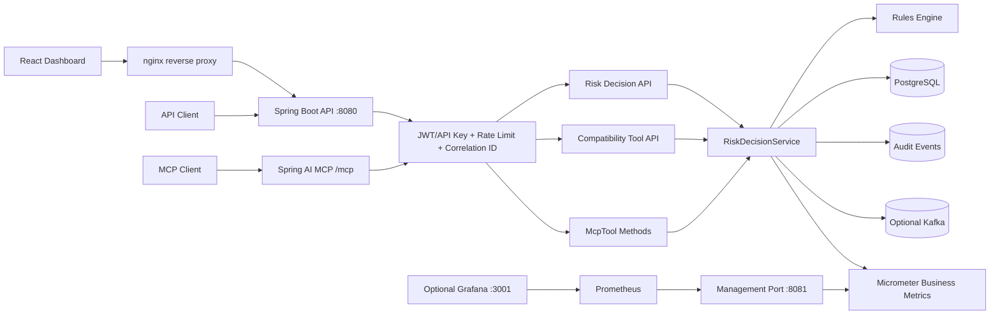
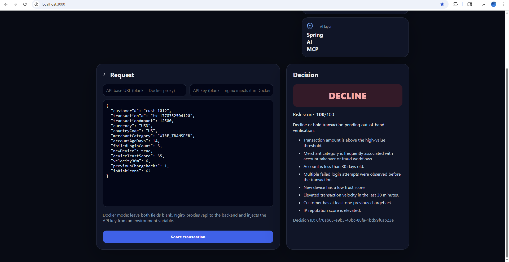
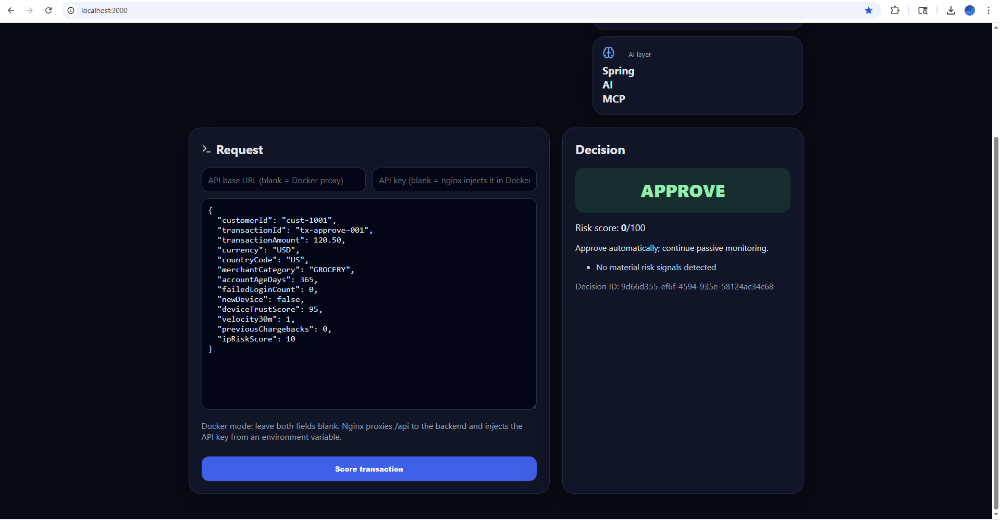
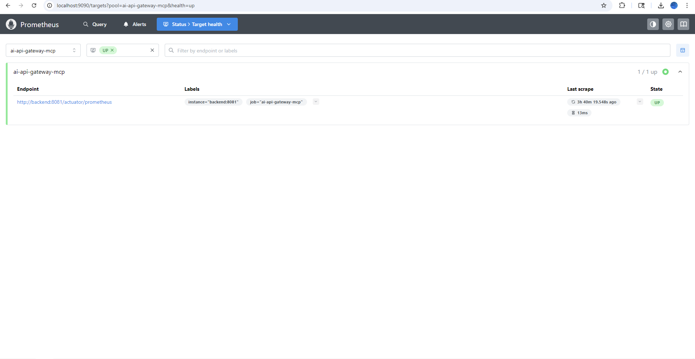
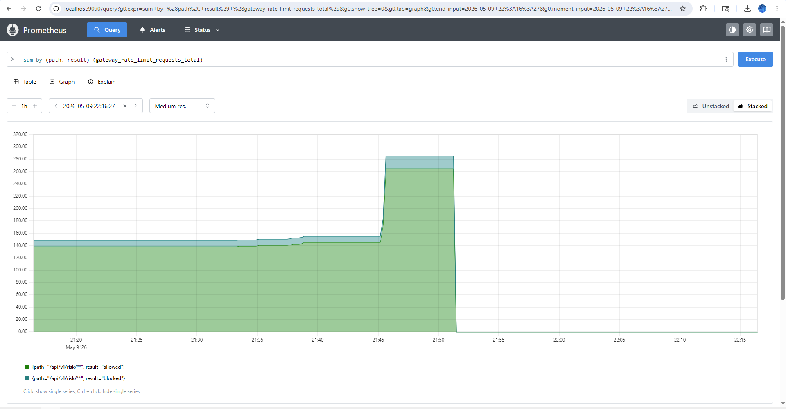
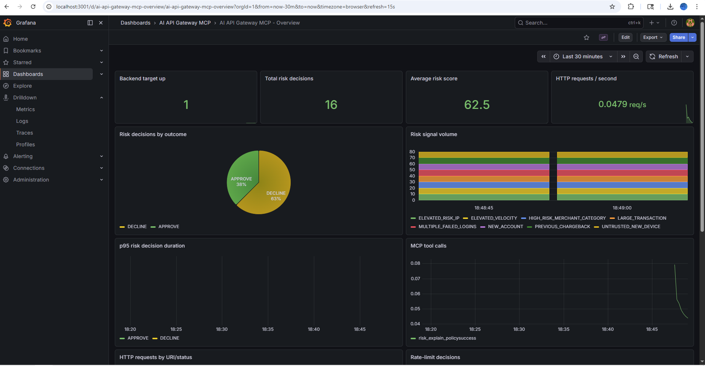
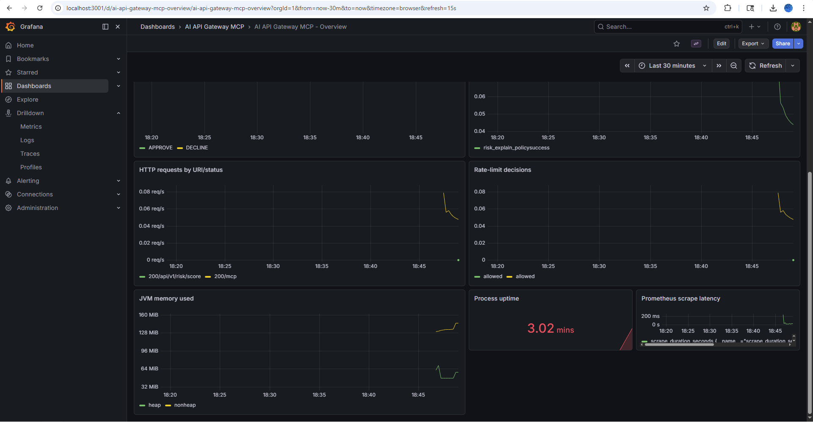
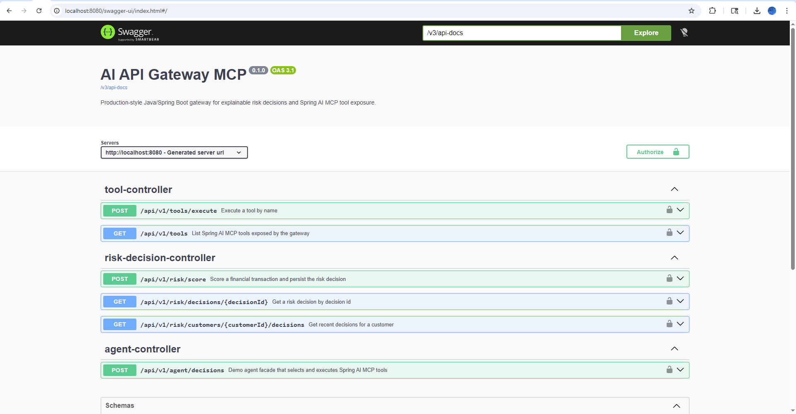
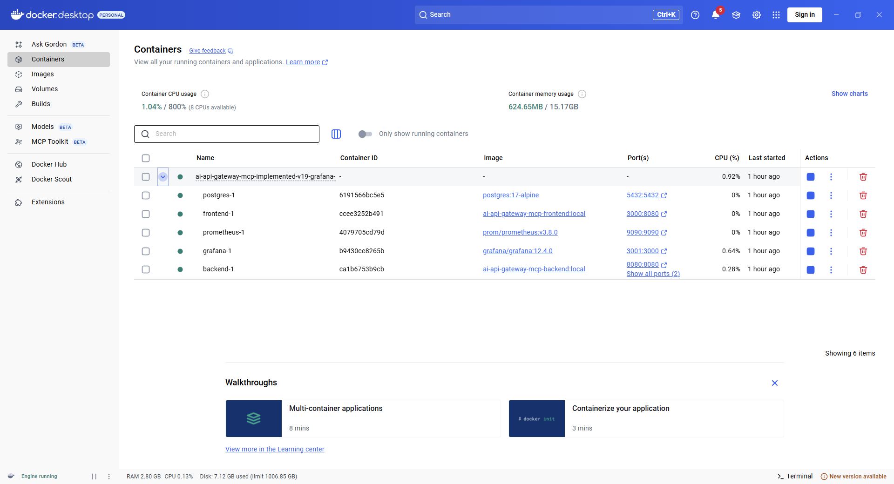
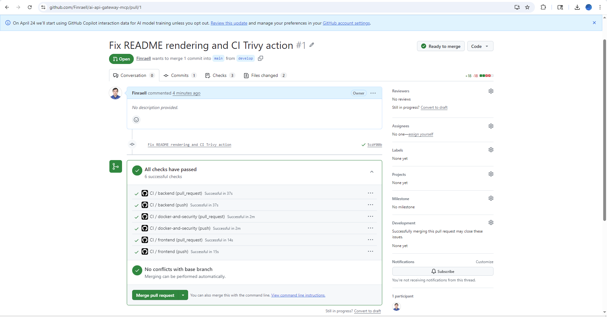

# AI API Gateway MCP


Production-style **Java/Spring Boot API gateway** for explainable financial risk decisions with a real **Spring AI MCP server** exposing deterministic backend capabilities as MCP tools.

This is intentionally a recruiter-facing flagship repo. It demonstrates backend engineering, API platform design, Spring AI MCP, security guardrails, Dockerized deployment, business observability, audit persistence, database migrations, CI checks, and a React dashboard.

> This is **production-style**, not a claim that it is ready to process real financial transactions without enterprise controls, compliance review, secrets management, and external identity infrastructure.

## What the system does

```txt
Browser / API client / MCP client
  -> secured Spring Boot gateway
  -> deterministic risk scoring engine
  -> explainable APPROVE / REVIEW / DECLINE decision
  -> PostgreSQL persistence
  -> audit event persistence
  -> structured JSON application logs
  -> custom Micrometer business metrics
  -> Prometheus scraping on a separate management port
```

## Core capabilities

- Java 21 + Spring Boot 4.0.6
- Spring AI MCP server using `@McpTool` / `@McpToolParam`
- Stateless MCP endpoint; no OpenAI, Claude, Anthropic, or other model-provider key required
- REST risk scoring API with explainable risk signals
- React/TypeScript dashboard served by nginx
- PostgreSQL in Docker, H2 locally
- Flyway database migrations
- JPA persistence with validation against migrations
- Persistent audit event table
- Structured JSON app log messages with correlation IDs
- Micrometer JVM, HTTP, and custom business metrics
- Prometheus scrape target on a separate management port
- Optional Grafana dashboard profile with provisioned Prometheus datasource
- API-key auth for Docker demo plus optional Bearer JWT HMAC verifier
- In-memory local rate limiting with metrics
- Idempotency key support
- Optional Kafka event publishing hook
- GitHub Actions CI with unit tests, Postgres integration test, Docker builds, and Trivy security scans

## Architecture



## Run the full app with Docker

```bash
cp .env.example .env
```

Edit `.env` and change at least:

```txt
GATEWAY_API_KEY=replace-with-a-long-random-local-secret
POSTGRES_PASSWORD=replace-with-a-long-random-db-password
GATEWAY_JWT_HMAC_SECRET=replace-with-at-least-32-random-characters
```

Start backend, frontend, PostgreSQL, and Prometheus:

```bash
docker compose up --build
```

Open:

```txt
Frontend:       http://localhost:3000
Backend API:    http://localhost:8080
Swagger UI:     http://localhost:8080/swagger-ui.html
Prometheus:     http://localhost:9090
Management:     http://localhost:8081/actuator/health  # bound to localhost only
Grafana:        http://localhost:3001                 # optional dashboards profile
```

In Docker mode, leave the frontend API key fields blank. The browser calls same-origin `/api`, nginx proxies the request to the backend container, and nginx injects `X-API-Key` from the runtime `GATEWAY_API_KEY` environment variable. No API key is baked into the React/Vite bundle.

Stop containers:

```bash
docker compose down
```

Stop containers and delete local PostgreSQL data:

```bash
docker compose down -v
```

## Prometheus and custom Micrometer metrics

Prometheus scrapes the backend through the private Docker network:

```txt
http://backend:8081/actuator/prometheus
```

The management port is separate from the application port and is bound to localhost only for the Docker demo:

```yaml
127.0.0.1:8081:8081
```

Useful PromQL queries:

```promql
up
```

```promql
sum by (decision) (risk_decisions_total)
```

```promql
sum by (decision) (risk_decision_score_sum) / sum by (decision) (risk_decision_score_count)
```

```promql
sum by (signal, severity) (risk_decision_signals_total)
```

```promql
histogram_quantile(0.95, sum by (le, decision) (rate(risk_decision_duration_seconds_bucket[5m])))
```

```promql
sum by (tool, status) (mcp_tool_calls_total)
```

MCP tool counters are registered in Java as `mcp_tool_calls`; Prometheus exports them as `mcp_tool_calls_total`. This avoids the confusing double suffix `*_total_total`.

```promql
sum by (path, result) (gateway_rate_limit_requests_total)
```

Helper script:

```powershell
./scripts/check-observability.ps1
```

## Optional Grafana dashboard

Grafana is included as an **optional** Docker Compose profile. It does not change the backend, frontend, or Prometheus flow. It gives reviewers a more visual observability demo and better README screenshots.

Start the full stack with Grafana:

```bash
docker compose --profile dashboards up --build
```

Open:

```txt
Grafana: http://localhost:3001
```

Login with values from `.env`:

```txt
GRAFANA_ADMIN_USER=admin
GRAFANA_ADMIN_PASSWORD=replace-with-a-long-random-grafana-password
```

Grafana is provisioned automatically:

```txt
Datasource: Prometheus -> http://prometheus:9090
Dashboard:  AI API Gateway MCP - Overview
```

## Screenshots

### Risk decision dashboard

The React dashboard can submit transactions to the secured backend API and display explainable risk decisions.

| Decline decision | Approve decision |
|---|---|
|  |  |

### Backend audit logging

Structured backend logs show decision creation, correlation IDs, risk score, signal count, and event-publishing behavior.


### Observability

Prometheus scrapes the backend on the separate management port, and custom Micrometer metrics expose rate-limiting and risk-decision behavior.

| Prometheus targets | Rate-limit metrics |
|---|---|
|  |  |

### Grafana dashboard

Grafana is provisioned with Prometheus as a datasource and visualizes backend health, risk decisions, HTTP traffic, rate limiting, JVM metrics, and MCP tool calls.





### API documentation and runtime

Swagger documents the REST API, and Docker Compose runs the full local platform.

| Swagger UI | Docker Compose stack |
|---|---|
|  |  |

### CI

GitHub Actions validates backend tests, frontend build, Docker image builds, and security scans.



## Score a transaction

```bash
curl -X POST http://localhost:8080/api/v1/risk/score \
  -H "Content-Type: application/json" \
  -H "X-API-Key: local-dev-key" \
  -H "Idempotency-Key: demo-001" \
  -H "X-Correlation-ID: demo-correlation-001" \
  -d '{
    "customerId":"cust-1001",
    "transactionId":"tx-9001",
    "transactionAmount":12500,
    "currency":"USD",
    "countryCode":"US",
    "merchantCategory":"WIRE_TRANSFER",
    "accountAgeDays":14,
    "failedLoginCount":5,
    "newDevice":true,
    "deviceTrustScore":35,
    "velocity30m":6,
    "previousChargebacks":1,
    "ipRiskScore":62
  }'
```

Expected result: `DECLINE`, high risk score, and explainable signals.

## Spring AI MCP tools

The MCP server uses the modern annotation approach:

```txt
@McpTool / @McpToolParam
spring.ai.mcp.server.annotation-scanner.enabled=true
spring.ai.mcp.server.protocol=STATELESS
spring.ai.mcp.server.stateless.mcp-endpoint=/mcp
```

No `ToolCallbackProvider` bridge is required, and no LLM provider API key is required.

Exposed MCP tools:

```txt
risk_score_transaction
risk_lookup_decision
risk_explain_policy
merchant_risk_lookup
```

Smoke test:

```powershell
./scripts/mcp-smoke-test.ps1 -BaseUrl http://localhost:8080 -ApiKey local-dev-key
```

## Optional JWT demo mode

The Docker demo keeps API key auth enabled because nginx injects the API key server-side. You can also enable the optional HMAC Bearer JWT verifier:

```txt
GATEWAY_JWT_ENABLED=true
GATEWAY_JWT_HMAC_SECRET=replace-with-at-least-32-random-characters
```

Generate a demo token:

```powershell
$token = ./scripts/create-demo-jwt.ps1 -Secret "replace-with-at-least-32-random-characters"
```

Call the API with Bearer auth:

```powershell
Invoke-WebRequest http://localhost:8080/api/v1/tools -Headers @{ Authorization = "Bearer $token" }
```

Production note: replace this demo HMAC verifier with a real OAuth2/OIDC resource server configuration backed by an identity provider.

## Database migrations and audit persistence

Flyway migrations create:

```txt
risk_decisions
risk_decision_reasons
risk_decision_signals
audit_events
```

JPA runs in validation mode in Docker, so the application starts only if entity mappings match the migration-managed schema.

Audit records include:

```txt
event_type
aggregate_id
correlation_id
principal
payload_json
created_at
```

## Tests and CI

Run unit tests:

```bash
mvn test
```

Run the PostgreSQL integration test locally if Docker is available:

```bash
RUN_POSTGRES_IT=true mvn -Dtest=RiskDecisionPostgresIntegrationTest test
```

CI includes:

- backend unit tests
- PostgreSQL integration test via Testcontainers and Spring `RestClient`
- Maven package
- frontend build
- backend/frontend Docker image builds
- Trivy image and filesystem security scans

## Production-style controls included

| Control | Included implementation |
|---|---|
| No public actuator endpoints | management port `8081`, localhost host bind, Prometheus uses Docker network |
| Separate management port | `management.server.port=8081` in Docker profile |
| Stronger auth path | optional Bearer JWT HMAC verifier plus API key demo fallback |
| Rate limiting | in-memory per-client/path limiter with Prometheus metrics |
| Correlation IDs | `X-Correlation-ID` request/response header and MDC |
| Audit log persistence | `audit_events` table with JSON payload |
| Database migrations | Flyway migrations + JPA validate mode |
| Structured logs | application event logs emitted as JSON payloads |
| Container hardening | non-root backend user, unprivileged nginx runtime, no build-time secrets |
| CI security checks | Trivy scans for images and filesystem dependencies |
| Grafana dashboard | optional profile with provisioned Prometheus datasource and starter dashboard |
| Postgres integration tests | Testcontainers-based integration test using Spring `RestClient` |
| MCP compatibility check | PowerShell MCP JSON-RPC smoke script |

## Honest limitations

This repo is production-style, but a real financial production deployment should still add:

- external OAuth2/OIDC issuer validation instead of the demo HMAC JWT verifier
- Redis or gateway/service-mesh rate limiting instead of in-memory rate limiting
- Vault/AWS Secrets Manager/GCP Secret Manager for secrets
- TLS termination and certificate management
- OpenTelemetry traces
- centralized log aggregation
- stricter network policies
- vulnerability gates that fail builds after an agreed baseline
- load testing and SLO dashboards
- formal threat modeling and compliance review

## Frontend Docker build reliability

The frontend Dockerfile pins npm to `10.8.2`, installs build tooling during the build stage, and verifies that `tsc` and `vite` are available before running the production build. This keeps the Docker build deterministic and avoids partially installed frontend dependencies.

## Maintenance notes

Flyway migrations run before Hibernate schema validation in Docker. If the local PostgreSQL volume contains an outdated or partial schema, reset local Docker data before retrying:

```powershell
docker compose down -v
docker compose up --build
```

The PostgreSQL integration test uses the modern `org.testcontainers.postgresql.PostgreSQLContainer` package, Spring Boot `@ServiceConnection`, and Spring `RestClient`.

## Production deployment notes

This repository is intentionally runnable with Docker Compose and `.env` variables for local evaluation. Vault/AWS Secrets Manager/Azure Key Vault/GCP Secret Manager and TLS termination are documented rather than required because requiring them would make the repo harder for reviewers to run.

For a real production deployment:

- replace `.env` secrets with Docker secrets, Vault, AWS Secrets Manager, Azure Key Vault, GCP Secret Manager, or Kubernetes Secrets
- terminate TLS at an ingress controller, API gateway, load balancer, reverse proxy, or service mesh
- keep Postgres, Prometheus, and actuator endpoints on private networks
- replace the demo HMAC JWT verifier with OAuth2/OIDC issuer validation
- move rate limiting to Redis, API Gateway, Envoy/Nginx, WAF, or service mesh for multi-instance deployments
- send logs and audit events to durable centralized infrastructure with retention policies

## MCP metrics note

MCP tool-call metrics are recorded directly inside the `@McpTool` implementations so stateless Spring AI MCP invocations are visible in Prometheus/Grafana even when the MCP annotation scanner invokes tool methods outside normal Spring AOP proxy flow.
